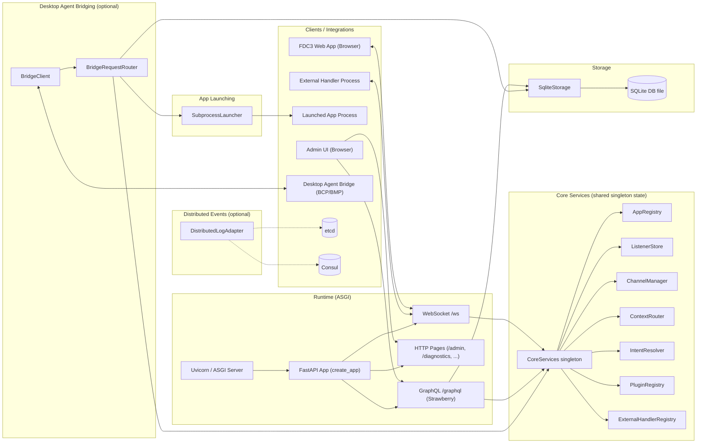
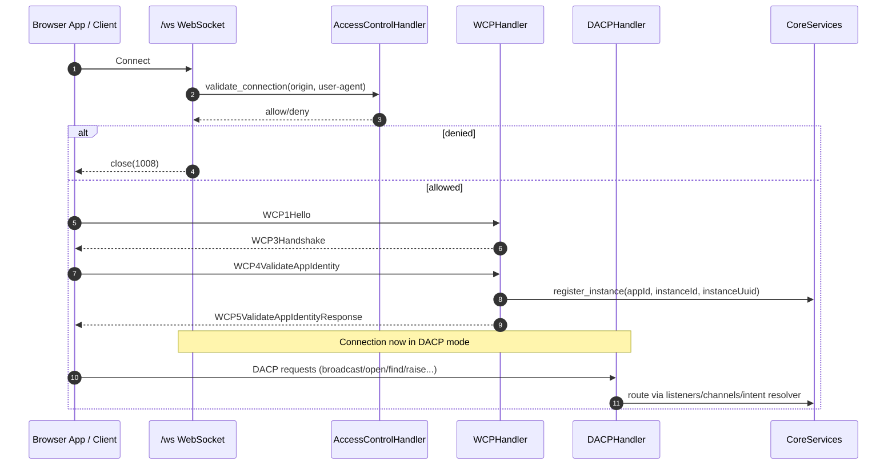
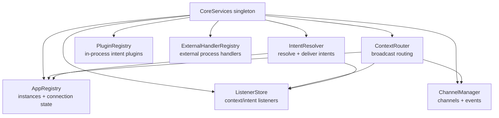
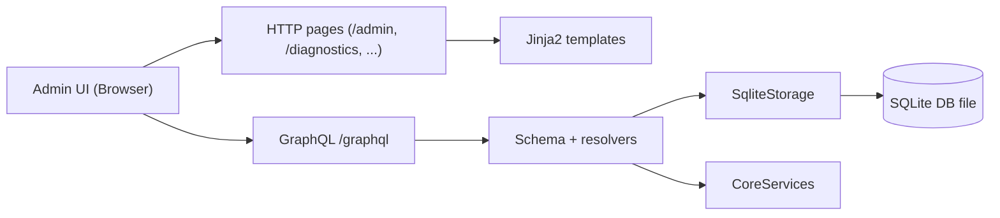
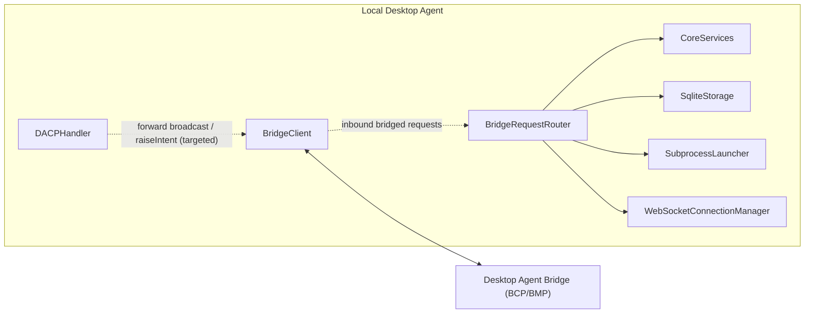
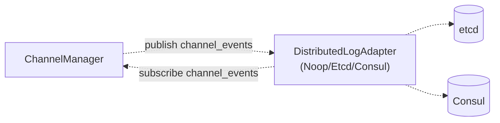

# System flowcharts

This document breaks the agent into a few small Mermaid diagrams so they render cleanly in VS Code’s Markdown preview and are easier to reason about.

## 1) High-level overview

This shows the major subsystems and how requests enter the system (WebSocket, HTTP pages, GraphQL), plus the optional bridging/distributed components.

## 2) WebSocket protocol phases (WCP → DACP)

The `/ws` endpoint starts in the WCP handshake/identity validation phase. Once validated, it transitions to the DACP phase for ongoing FDC3 operations.

## 3) Core services and message routing

This diagram focuses on how context and intents move through the in-memory core. The core is a singleton so WebSocket handlers, GraphQL, plugins, and background components all share the same state.

## 4) Storage + admin/GraphQL surfaces

Admin pages are static HTML templates, while GraphQL provides read/write access to app directory and launch config data plus observability over connected instances and channels.

## 5) Desktop Agent Bridging (experimental, optional)

When bridging is enabled, the agent maintains an outbound WebSocket connection to a Desktop Agent Bridge. Some outbound actions are forwarded best-effort, and inbound bridged requests are routed through the BridgeRequestRouter into local storage/core/launcher/connection manager.

## 6) Distributed channel events (optional)

If a distributed adapter is configured, channel events are published to an external backend so multiple agent workers can observe each other’s channel activity. Local delivery still happens even if the adapter fails.

